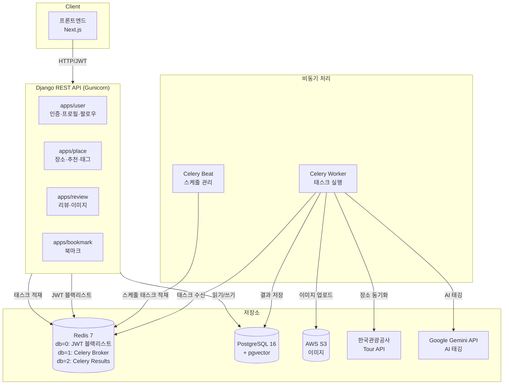
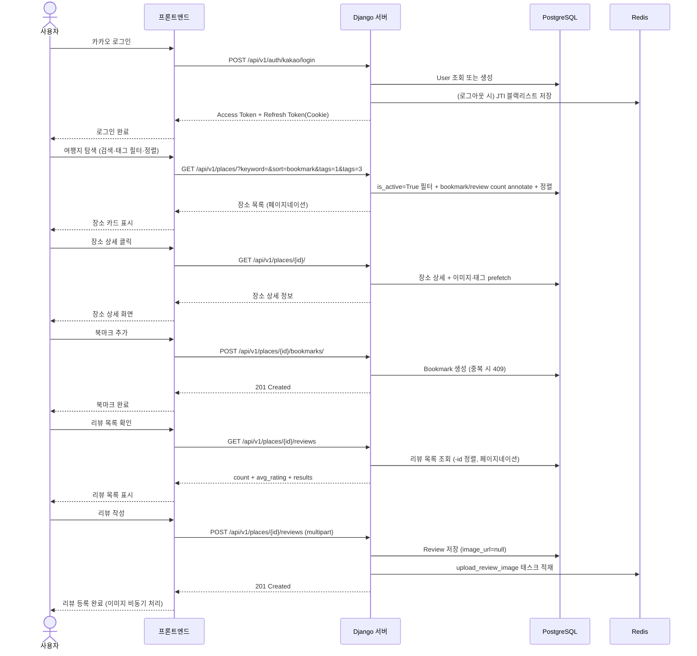
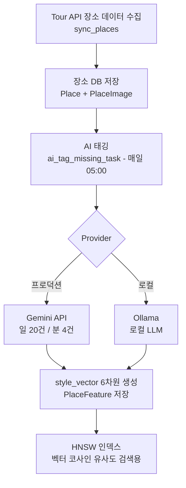
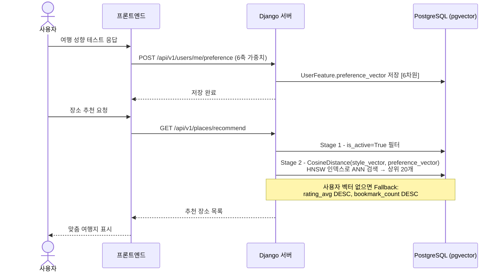
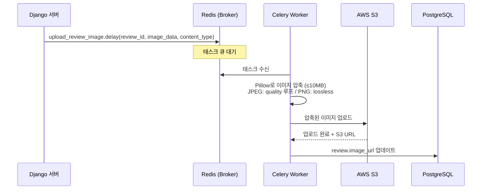
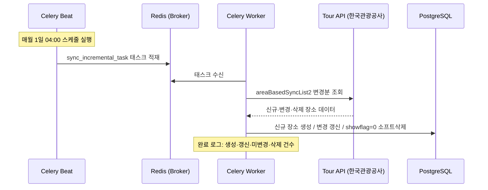
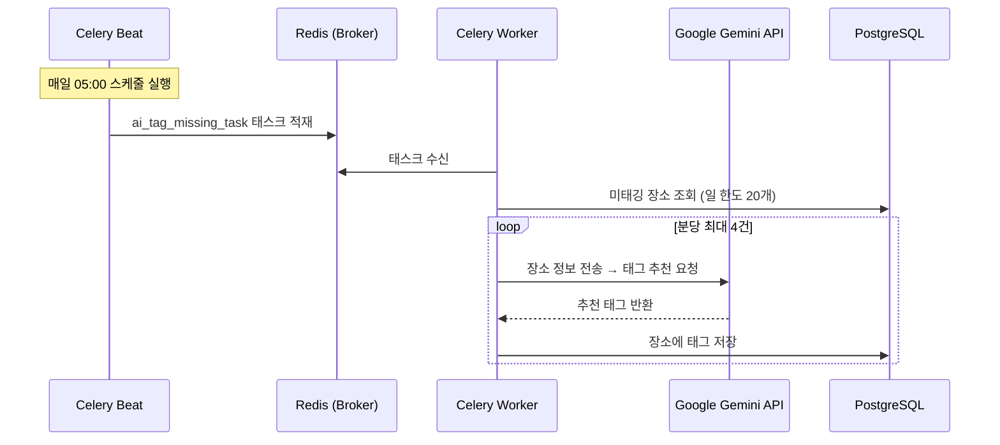

# TravelMaker 전체 시스템 플로우

## 1. 전체 아키텍처

---

## 2. 사용자 흐름 (End-to-End)

---

## 3. 추천 시스템 흐름

### 3-1. 장소 스타일 벡터 생성 (AI 태깅 파이프라인)

**style_vector 6차원 구조:**

| 축 | 의미 | 0.0 | 1.0 |
|---|---|---|---|
| [0] activity | 활동성 | 힐링 | 액티브 |
| [1] planning | 계획성 | 즉흥 | 계획적 |
| [2] sociability | 사교성 | 혼자 | 그룹 |
| [3] space | 공간 | 자연 | 도심 |
| [4] experience | 경험 | 문화 | 체험 |
| [5] spending | 지출 | 저예산 | 고예산 |

---

### 3-2. 사용자 선호 벡터 생성 및 추천 흐름 (예정)

> **현재 상태**: `PlaceFeature.style_vector` 및 AI 태깅 완료.
> `UserFeature.preference_vector` 및 `/api/v1/places/recommend` 엔드포인트는 구현 예정입니다.

---

## 4. Celery Worker 태스크 흐름

### 3-1. 리뷰 이미지 업로드 (사용자 트리거)

> 실패 시 `image_url`은 `null`로 유지됩니다.

---

## 4. Celery Beat 스케줄 태스크 흐름

### 4-1. 장소 데이터 증분 동기화 (매월 1일 04:00)

### 4-2. AI 태그 자동 부여 (매일 05:00)

---

## 5. Celery Worker vs Celery Beat 요약

| 구분 | 역할 | 트리거 | 태스크 |
|---|---|---|---|
| **Celery Worker** | 큐에서 태스크를 꺼내 실행 | Django `.delay()` 호출 또는 Beat 적재 | `upload_review_image` |
| **Celery Beat** | 주기적으로 태스크를 큐에 적재 | cron 스케줄 | `sync_incremental_task` (월 1회), `ai_tag_missing_task` (일 1회) |

> **핵심 차이**: Beat는 "언제 실행할지" 결정, Worker는 "실제로 실행"합니다.
> Beat가 없으면 스케줄 태스크는 실행되지 않고, Worker가 없으면 큐에 쌓이기만 합니다.
